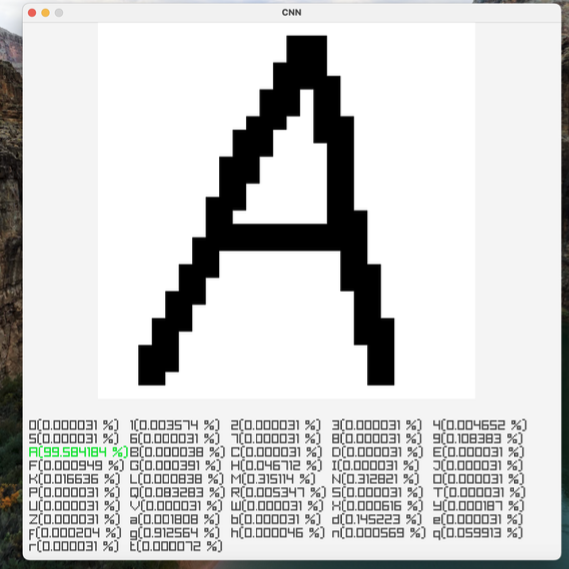

# 🤖 TinyML: Machine Learning on Microcontrollers

Welcome to the **TinyML Project**, developed at Télécom Paris by students of Proj104.  
This project explores how to implement deep learning models — including **dense neural networks (ANN)** and **convolutional neural networks (CNN)** — on low-power microcontrollers using efficient C code and lightweight tools.

We extend the functionality of the open-source library [Genann](https://github.com/codeplea/genann) by:

- Adding support for the **ReLU activation function**
- Implementing **convolutional layers**
- Developing full **forward and backward propagation for CNNs** in C
- Optimizing model performance (training time, precision, memory usage)

The models are trained using the **MNIST** and **EMNIST** datasets and deployed using Docker containers, enabling high portability — including to devices like Raspberry Pi.

## 📊 Model Optimization Results

We trained and tested 361 models with various numbers of hidden layers and neurons. The best-performing models reached over **94% accuracy** with fast training.

*Accuracy² / Training Time using Sigmoid activation*

## 🧠 CNN Implementation

To boost image classification performance, we implemented **convolutional neural networks (CNN)** with multiple filters per layer.  
We also added full **backpropagation for CNNs**, enabling learning from scratch directly on low-power devices.

*Our Sequential CNN architecture in C (inspired by LeNet)*

## 🖥️ Live Demo (Dockerized)

Our final demonstration is a web app that predicts handwritten characters drawn by the user.

*Web interface for real-time handwritten character recognition*

## 📌 Project Poster

Curious about the full project in one glance?  
Check out our official poster summarizing the goals, methods, and key takeaways of TinyML:

